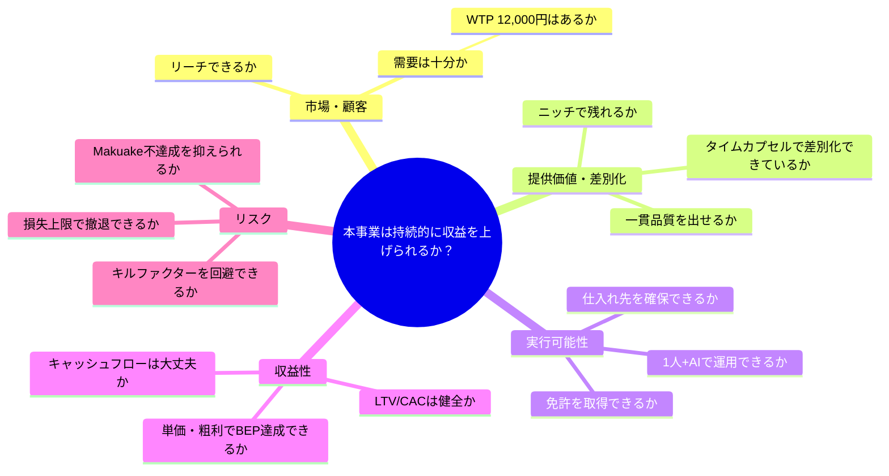
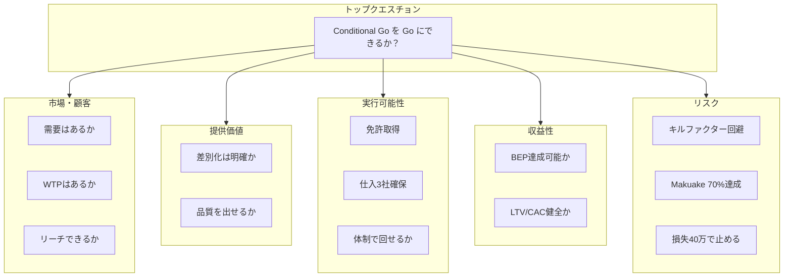
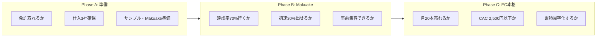

# イシューツリー: 結婚式タイムカプセルワイン事業

## トップクエスチョン

**「本事業は、Conditional Go を Go にし、持続的に収益を上げられるか？」**

---

## ツリー構造（論点の分解）

```
本事業は持続的に収益を上げられるか？
├── 1. 市場・顧客は成立するか
│   ├── 1.1 需要は十分にあるか（婚姻数・記念日・法人）
│   ├── 1.2 顧客は12,000円の価値を認めるか（WTP）
│   └── 1.3 リーチできる顧客に届くか（チャネル・認知）
│
├── 2. 提供価値・差別化は成立するか
│   ├── 2.1 「タイムカプセル体験」は競合と差別化されているか
│   ├── 2.2 ワイン・ラベル・リマインドの一貫品質を出せるか
│   └── 2.3 大手参入時にもニッチで残れるか
│
├── 3. 実行可能性はあるか
│   ├── 3.1 免許（通信販売酒類小売業）を取得できるか
│   ├── 3.2 小ロット対応の仕入れ先を確保できるか
│   └── 3.3 1人+AIで運用できるか（体制・コスト）
│
├── 4. 収益性は成立するか
│   ├── 4.1 単価・粗利でBEP（月3～5本）を達成できるか
│   ├── 4.2 LTV/CACは健全か（目標3倍以上）
│   └── 4.3 キャッシュフローは破綻しないか（先払い・受注生産）
│
└── 5. リスクは許容範囲か
    ├── 5.1 キルファクター（免許・仕入・品質）を回避できるか
    ├── 5.2 Makuake不達成リスクをどこまで下げられるか
    └── 5.3 損失上限40万円で撤退判断できるか
```

---

## Mermaid でビジュアライズ

### 1. マインドマップ形式（イシューツリー全体）



### 2. フローチャート形式（Go 達成に必要な条件）



### 3. ブロック形式（Phase 別の重要イシュー）



---

## 使い方

- **意思決定**: 上のトップクエスチョンに対して、各枝（1.1～5.3）を Yes/No で検証すると、Go/No-Go や施策の優先度が整理できる。
- **Mermaid の表示**: GitHub / GitLab の Markdown プレビュー、VS Code の Mermaid 拡張、[Mermaid Live Editor](https://mermaid.live/) などで図を表示できる。

---

**作成日**: 2026年2月12日  
**事業名**: 結婚式タイムカプセルワイン事業
